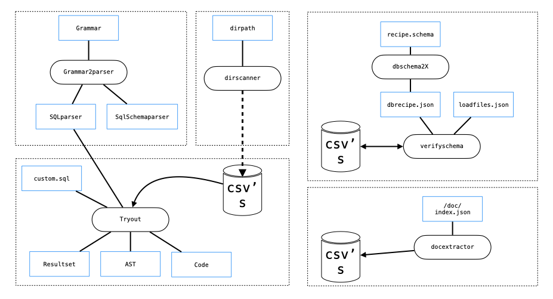
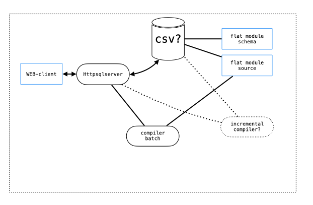
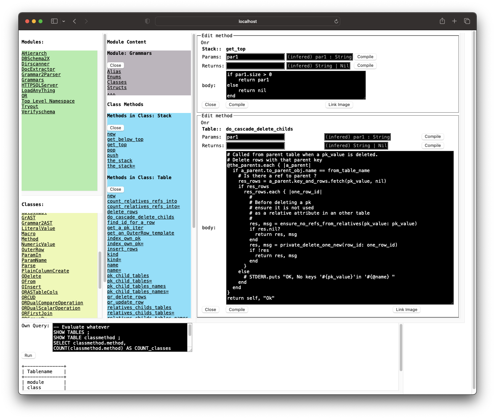

# pocket-sql


I have had doubts before publishing this bunch of code. Because it does not have any distinct goal but several diffuse ones. It's more results from experiments in many areas. It can be seen as a garden of try outs.

It's mainly around 
> 
> `SQL Foreign Keys` - ***Foreign Keys in SQL are actually Family Keys***.

Look at the serious appendix on `SQL Foreign Keys`. You don't need to read in order to explore the source.

I have not plan to maintain this the traditionally way but perhaps download new versions. Of course I will respond to any issuses.

The source is poor documented, there is no `spec`, no fancy coding I think. Spot on structure and algorithms.

The trace from develpment is 

* `crystal` all the way. Robust, compact, expressive, fast, friendly, reliable... Great community
* SQL
* Foreign Keys
* Implement Referential Integrity algoritms via `SqlSchema`
* SQL compiler
* Precompile SQL into stored procedures with optional run time parameters
* Imports and process of one or more CVS-files. As is or via a SqlSchema describing entities and relationships (EAR)

and the implementaions resulted in executables for diffrent tasks a la

* Generate parser for grammars (SQL and SqlSchema)
* Compile SQL
* Generate Shema (Standard SQL and SqlSchema)
* Execute SQL with optional Referential Integrity
* Very late in the development a WEB interface towards a http-server holding an imaginary compiler with a database on program source parts making incremental compilation on changed units from the WEB client. Very, very experimental. See Further Development

The SQL is selfcontained. No foreign engine!


<p style="text-align: center;">- fig1.png -</p>

## Installation

Download to `mydir`

```sh
> cd mydir
> shards build --debug
> crystal docs
```

## Usage

(You can goto `./tryout` direct and try some sql scripts)

### Note on SQL 'From' (TableFactor)

Data is imported from `csv`-files all the way. And saved in that form if you want to.

We use CSV-files in the `FROM` by extending the grammar.

Be aware the variants on `...FROM...` in a SQL-statement. The tables is `'Files'`

1. ` FROM './examples/data/usersixten.csv' AS Files (
    dir,
    name,
    extension,
    type,
    date,
    time,
    size
  )`
2. ` FROM './examples/data/usersixten.csv' AS Files `
3. ` FROM Files `

1 is loading an csv file and defining its columns

2 is loading an csv file but using definitions on FILE using a `SqlSchema`

3 use the FILE defined in `SqlSchema` (look into `./dbschema2X` and `./docextractor`)

Look into `./examples/sql` for more general examples.

## /grammar2parser - Generate parser for grammars

This step is only to be excuted if you change the distributed grammars.

This leg holds EBNF grammars and parser. Simple recursive descent parser approach without any implicit operator precedence. You must use parenthesis to deal with precedence.

There is one grammar for `SQL` ( SQL Data Manipulation ) and one grammar for `SqlSchema`. This SqlSchema is a language for generating standard sql `CREATE TABLE` where all issues around `FOREIGN KEY` is taken care of. See Appendix.

```sh
> ./bin/grammar2parser -g sql -p ./src/pocketlib/parse/parsesqlextended.cr
> ./bin/grammar2parser -g sqlschema -p ./src/dbschema2X/parsecreateextended.cr
```
There is a switch `-c` which will generate a skeleton for codegenrator, but it's not useful at the moment.

You can also use this leg for genarate 'any' grammar of your taste and topic.

## /dbschema2X - Generate Schema (CREATE TABLE's) for SQL or SqlSchema for pocket-sql

Assume we have a `SqlSchema` for a Recipe `recipe.schema`. 

```
> ./bin/dbschema2X -s ./src/dbschema2X/examples/create/recipe.schema -c ./src/dbschema2X/examples/createsql/dbrecipe.sql
> ./bin/dbschema2X -s ./src/dbschema2X/examples/create/recipe.schema -d ./src/dbschema2X/examples/geneddbdef/dbrecipe.json
```
The -c output `dbrecipe.sql` can be fed directly into your sql engine of your taste in order to create tables with all Referential Integrity defined. 

The -d `dbrecipe.json` is used when utilize Foreign Keys in a `SqlSchema`. Look into ./h and more sql exersices.

## /tryout - Compile SQL, save AST and/or save Code and/or execute.

This leg holds most use cases of all steps. 

Here is usage compile and execute:

```
> /bin/tryout -s ./examples/sql/group1.sql -x -o -d
> /bin/tryout -S ./examples/sql -x -o -d
```

You can use ``./bin/tryout -s a.sql -c a_code.json`` to save as stored procedure and then later on use ``./bin/tryout -c a_code.json -x`` to execute.

You can provide parameter values when executing compiled question. Look into `./examples/params`

Look into `./examples/sql/*.sql' for all kinds of SQL like:

`SHOW, SELECT, INSERT, UPDATE, DELETE, WITH, RECURSIVE, VALUES, FROM, JOIN, UNION, GROUP BY, ORDER BY, HAVING, aggregate functions, project functions, subqueries etc`


## /dirscanner - Application: Scan file directory 

Scan given directory for files and save attributes as `.CSV` for import or as `SQL INSERT...`

I did this application as a complement to all dir listing tools there is. I want the clean up my disk and was looking for duplicates, filenames like 'copy' or 'untitled'. My disk hold some 130_000 files before cleanup.

1. `./bin/dirscanner -d some_directory >some_directory.csv` 
2. look into `./examples/dir*.sql` for typical queries. Create an sql `example1.sql` as 

``SELECT
  *
FROM
  './some_directory' AS files(
    dir,
    name,
    extension,
    type,
    date,
    time,
    size
  )
WHERE
  files.name LIKE '_copy%'
  OR files.name LIKE 'Untitled_'
ORDER BY
  dir,
  name,
  date,
  time,
  size;``

3. `./bin/tryout -s example1.sql -x -o -d`

This, scanning directory, and process the `resultset` can be scripted into a `crystal` program of cource. (unix mv, rm etc)

## /verifyschema - Embedded SQL in `crystal` program

This is an example executing sql statements in a `crystal` program. The database is a recipe collection. It exercise select, insert, update, delete and joins, group by etc. Finnaly the database is saved into cvs-files. Kind of template. Other database is also explored. Have a look int `./src/verifyschema/main.cr` for usage.

## /httpsqlserver -  HTTP-server with application and resident database 

WARNING! Be ware of this application might be public accessible depending on your network setup. And there is no Authentication and the application can execute raw SQL from the client.

usage is :

> ```
> server : `./bin/httpsqlserver `
> browser : `http://localhost:8084/src/j/index.html`
> ```

This is a stright forward useage of the `http/server` in `crystal`. The application opens a database covering a small part of `./docs/index.json` at start up time and answer tailord request from a simple client. It is NOT at all a complement to the traditional `./docs/index.html`. The objectives here the test different kind of requests: Tailored, SQL-queries on the fly and Stored Procedure. Answers are quite tiny. You can execute any sql towards the database.

Look into `./src/httpsqlserver/backend.cr` and what `LoadAnyThing` refer to in order to understand how things are set up.


## /docextractor - Extract information from `/docs/index.json`

In order to supply the `/httpsqlserver ` with data above I did wrote this collector on very basic information from the  `/docs/index.json` in order to get some living information for a small database. It holds the following simplified model `./k/data/dbdef.sql`

```
ENTITYTABLEs 
 module, pk(module)
 class, pk(class)
 method, pk(method)
RELATIONSHIPTABLEs
 classmethod, pk (class, method)
 modulemethod, pk (module, method)
```
The appliction will create one .csv file for each table.

## Further development

* PocketSQL : Optimize joins, and conditions, by utilize information on Foreign Keys. Either via an optimzer step or introduce possibility to explicit in the SQL statement specify what index to use. 
* HTTPSQLServer : Crystallize, take shape of, the very text source of a OO-project so that will become objects too! Provocative to say that the traditionally style where sources are embossed by programmers taste and preferences. That will soon be old fashioned I think. Split the source into object with attribute. Define some kind of 'flat' module (cabinet, board...). Secure, increment compile, less energy ... (But 'fill in the form' will be rejected for many/most? programmers )


<p style="text-align: center;">- fig2.png -</p>



<p style="text-align: center;">- fig4.png Browse/Edit types-</p>

## Appendix

## Foreign Keys in SQL are actually Family Keys

### Background
Every time when I have been involved with Primary Keys and SQL I must relearn and recapitulate from ... what?
Not from memory or examples or tools but with struggle. So in this final? ambitious project - implementing referential integrity on EAR - I forced myself to fabricate a pattern in order to nail things down. I achieved alternate syntax for CREATE TABLE. (CREATE FAMILY?)

1. Primary key. As traditionally.
2. Parent. One or more columns in a part of primary key that will use, or is dependent, or inherits values from a Parent Table. This is the Primary key (FOREIGN KEY ... REFRENCES parent ... ) 
3. Child. Knowledge for a table that one or more other tables use it as a Parent.
4. Relative. One or more Attributes in a Table - but not as part of the primary key - which is related to an other table and its Primary Key. (FOREIGN KEY ... REFRENCES relative ... )
5. Sibling / Cousin. That is a referential cycle. Not explicit expressed or addressed in this first part. The suggested implemenation storage will handle that though. Relative can be Sibling / Cousin IRL but I think a Parnet can't be a Sibling / Cousin IRL. Tonnes of writing exists in this matter!


So this concept or naming entail new experimental syntax for CREATE TABLE. 

### Implementation in `crystal`

I have utilized standard Collections like Array and Key/Value to store information. They are common in most languages. But I choose that language because it's compact, expressive, powerful, have good collection storing on any composite types and smart methods and it is so easy to recfator! And all is object.

In the `./src/pocketlib/execute/` we have `tableinsert.cr`, `tableupdate.cr`, `tabledelete.cr` and `./src/pocketlib/` we have `dbschema.cr` which inplements all Referential Integrity checks
### Simplified grammar for SqlSchema

```
schema : ENTITYTABLE (enttable) RELATIONSHIPTABLE (reltable) ;
enttable : tablename pkname plaincols* relativecols* 
reltable : tablename parent_tablename+ plaincols* relativecols*
```


### Examples

```sql
CREATE 
  ENTITYTABLE 
  (
    Livsmedel 
      PRIMARYKEY ( Livsmedel 'varchar(100)' )
      PLAINCOLUMN (kcal 'int(11)', 
        notering 'varchar(253)', 
        pris 'float' )
  
    Kategori  
      PRIMARYKEY ( Kategori 'varchar(30)')
      PLAINCOLUMN (Kategoribeskrivning 'varchar(255)')

    Recept
      PRIMARYKEY ( Recept 'varchar(50)')
      PLAINCOLUMN (AntalPortioner 'int(11) null', 
        TillagningsTid 'int(11) null',
        Ursprung 'varchar(100)',
        Beskrivning 'varchar(10)'
        )
  )
  RELATIONSHIPTABLE
  (
    KategoriOchRecept
      PRIMARYKEY (
        PARENTS (Kategori, Recept)
    )
    Receptsteg
      PRIMARYKEY (
        PARENTS (Recept)
        OWNPRIMARY (Steg 'varchar(3)')
      )
      PLAINCOLUMN (Kortbeskrivning 'varchar(20)',
        Minuter 'int(11)',
        Beskrivning 'varchar(253)'
      )
    Receptstegsingrediens
      PRIMARYKEY (
        PARENTS (Receptsteg, Livsmedel)
      )
      PLAINCOLUMN (Antal 'float',
        Enhet 'varchar(32)'
      )
    ReplaceIngred
      PRIMARYKEY(
        PARENTS (Livsmedel, Livsmedel PREFIXED 'NYTT_')
      )
      RELATIVECOLUMN ( KategoriOchRecept PREFIXED 'pref_')
      PLAINCOLUMN (FOM 'float')
  );
```

